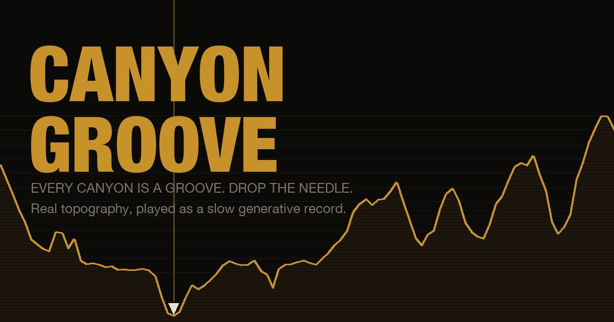
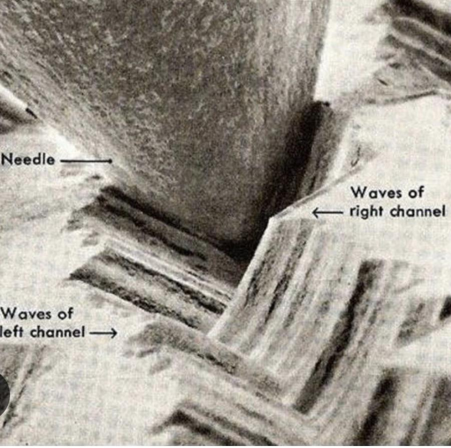

# Canyon Groove

Real canyon topography, played as a slow generative ambient record. A page on [cumberlandcoast.com](https://cumberlandcoast.com), built by the studio.



Pick a canyon. Its rim-to-rim elevation profile becomes a record groove. Five voices each ride a stylus across that groove at their own loop length, and because the loop lengths never divide evenly, the piece never repeats. Steep walls chime. Flat floors go quiet. Deeper canyons echo longer. Export two minutes as an MP3, post a share card, or save the cut with your email.

Static site, no build step. Everything is synthesized in the browser with the Web Audio API.

## Where it came from



This photograph, posted to [r/vinyl by Total_Doofuss484](https://www.reddit.com/r/vinyl/comments/zuapb3/a_close_up_picture_of_a_record_groove_and_needle/) in 2022. When I saw it, where the magnified microscopic record player needle sits between the vinyl record’s tracks, I thought the groove walls looked like canyon walls. They look ridged and layered, and the shape of those walls is the music. I wondered whether it works the other way round. Could you take a real canyon, treat the cross-section as a groove, and use AI to drag a needle through the canyon grooves?

## How the terrain writes the music

| Terrain fact | Musical result |
|---|---|
| Floor elevation | Key (`round(floor_m / 100) mod 12`) |
| Symmetry of the two walls | Mood. Balanced walls play Bright or Open, lopsided ones play Dusk or Dark |
| Canyon width in km | Base loop length (28 to 72 seconds per pass) and the delay time |
| Relief in metres | Reverb tail (3 to 8 seconds) and contour spacing |
| Elevation under each stylus | Pitch, filter brightness, stereo position |
| Slope under the Wind stylus | Wind loudness and resonance |
| Stylus crossing a contour line | One note, pitched by which contour it crossed |
| Stylus in the lowest 18% of the profile | River notes |

| Voice | Loop ratio | What it does | Instruments |
|---|---|---|---|
| Bedrock | 1.000 | Low drone on the key, filter follows terrain | Drone, Organ, Sub, Strings |
| Strata | 1.618 | Slow overlapping chords read from elevation | Pad, Glass, Choir, Reed |
| Contours | 0.786 | One note per contour crossing | Bell, Marimba, Pluck, Piano, Chime |
| Wind | 2.236 | Noise through terrain-tracking filters | Wind, Rain, Static |
| River | 1.272 | Sparse high notes at the floor | Pluck, Drops, Harp |

Every voice has seven settings, 0 to 100, under its **tune** tab: **Level**, **Attack**, **Decay** (note voices only), **Tone**, **Grit** (saturation), **Echo** (reverb send) and **Delay** (a feedback delay timed to the canyon’s loop). They change live while the piece plays. Double-click a slider to reset it.

## The URL is the piece

```
#grand,bedrock,strata,contours:marimba,wind,contours.echo=80,seed=48213
```

| Token | Meaning |
|---|---|
| `grand` | Canyon id. See the table below. |
| `bedrock`, `strata`, `contours`, `wind`, `river` | Voices on. Omit all of them for the default four. |
| `contours:marimba` | A voice with a non-default instrument (lowercase names from the table). |
| `contours.echo=80` | A voice setting: `level`, `attack`, `decay`, `tone`, `grit`, `echo`, `delay`. Only non-defaults are written. |
| `key=D` or `key=Fs` | Override the key. `s` for sharp. |
| `mood=dusk` | Override the mood: `bright`, `open`, `warm`, `dusk`, `dark`, `simple`. |
| `seed=48213` | Random seed. Same seed, same cut. |
| `today` | Today’s cut: the canyon and seed change once a day, worldwide. |
| `song=Dusk%20over%20the%20South%20Rim` | The song’s name, given in Share. Older links using `cut=` still work. |
| `by=Kristen` | Who passed it. Shows a “Passed to you” banner to the next listener. |
| `gen=2` | Pressing number in the chain. Each pass adds one. |

The app rewrites the hash with `history.replaceState` on every change, so the address bar is always a shareable link. A visit with no hash at all gets a random canyon and a random hand of two or three voices, so the front door never sounds the same twice.

## Sharing and capture

- **Share** is the one action: name your cut, add your first name, press Share. On a phone the share sheet opens with the card image and a link that carries `cut`, `by`, and `gen`; on desktop the link is copied and the card downloads. Whoever opens the link sees who passed it, hears the exact cut, and can share it on. Every pass adds a pressing.
- **Copy link** copies the current cut’s URL.
- **Save card** renders a 1080 by 1350 PNG of the cut (profile, cut name, who cut it, pressing number, key, mood, voices, link) over a photograph of that canyon, and hands it to the share sheet, or downloads it. Photos live in `images/` with `manifest.json` and `CREDITS.md`; 92 Unsplash-licensed shots, five to seven per canyon, a generic pool for the two canyons with no usable photos (Cotahuasi borrows Colca’s, Kali Gandaki borrows the Nanga Parbat set). `IMAGE_BASE` in `index.html` can point at another host, such as WordPress media, if that host sends CORS headers.
- **Download MP3** renders two minutes offline with the same engine and encodes a 192 kbps MP3 in the browser with [lamejs](https://github.com/zhuker/lamejs). Falls back to WAV if the encoder cannot load. Takes a few seconds.
- **Keep this cut** sends the email and the cut to `api/subscribe`, a small Vercel function that creates the subscriber through Buttondown’s API (tag `canyon-groove`, metadata `song-name`, `song-url`, `canyon`, `saved-at`) and returns a result the page can show: “Saved, check your inbox” for a new subscriber, “saved to your existing subscription” for a known one. It needs `BUTTONDOWN_API_KEY` set in the Vercel project (Buttondown: Settings, API). Without the route, for example on GitHub Pages or a local server, the form falls back to a plain Buttondown post in a new tab.
- A centered **Subscribe to The Catalog** button sits above the credits and links to buttondown.com/catalog in a new tab. It shows in embed mode too.
- The footer carries a plain **Subscribe** form to the same list, tagged `canyon-groove`, plus the site’s navigation and other links. The footer hides in embed mode.

## The canyons

Sixteen transects, 100 evenly spaced samples along a straight line, pulled September 16, 2026. Fifteen from the [Open-Meteo Elevation API](https://open-meteo.com/en/docs/elevation-api) (Copernicus DEM GLO-90, 90 m grid). Yarlung Tsangpo from [Open-Elevation](https://open-elevation.com) (SRTM). The dataset with coordinates, notes, and official sources is [`canyons.json`](canyons.json). The **?** on every canyon card opens an inline panel with a short note, a Play button, and a **Learn more** link to the official source (new tab, tagged `utm_source=cumberlandcoast.com` so the destination sees the page as the referrer). The **?** beside “real elevation, rim to rim” explains the method and its limits. Panels are inline rather than modal so they behave inside an iframe.

| id | Canyon | Relief on this line | Official source |
|---|---|---|---|
| `grand` | Grand Canyon, Arizona | 1,781 m | National Park Service |
| `hells` | Hells Canyon, Oregon / Idaho | 2,192 m | US Forest Service |
| `zion` | Zion Canyon, Utah | 753 m | National Park Service |
| `black` | Black Canyon of the Gunnison, Colorado | 808 m | National Park Service |
| `bryce` | Bryce Canyon, Utah | 511 m | National Park Service |
| `waimea` | Waimea Canyon, Kauaʻi | 830 m | Hawaiʻi Division of State Parks |
| `copper` | Copper Canyon (Urique), Chihuahua | 1,928 m | Chepe railway |
| `colca` | Colca Canyon, Peru | 2,496 m | PromPerú |
| `cotahuasi` | Cotahuasi Canyon, Peru | 1,464 m | SERNANP |
| `fish` | Fish River Canyon, Namibia | 533 m | Namibia Wildlife Resorts |
| `blyde` | Blyde River Canyon, South Africa | 816 m | Mpumalanga Tourism and Parks Agency |
| `yarlung` | Yarlung Tsangpo Grand Canyon, Tibet | 4,555 m | Britannica |
| `kali` | Kali Gandaki Gorge, Nepal | 5,414 m | National Trust for Nature Conservation |
| `indus` | Indus Gorge at Nanga Parbat, Pakistan | 6,930 m | Government of Gilgit-Baltistan |
| `verdon` | Verdon Gorge, France | 445 m | Parc naturel régional du Verdon |
| `tara` | Tara River Canyon, Montenegro | 823 m | National Parks of Montenegro |

Relief figures are what a 90 m grid sees along a straight 100-point line, so they run under published depths. Treat them as a floor.

## Run it locally

```bash
python3 -m http.server 8765
```

Open `http://localhost:8765/`. The MP3 encoder needs network for its first load; everything else works offline.

## Deploy

### Vercel (recommended host)

1. At [vercel.com/new](https://vercel.com/new), import `agentcorley/canyon-groove`. Framework preset **Other**, no build command, no output directory.
2. Under Environment Variables add `BUTTONDOWN_API_KEY` with the key from Buttondown (Settings, API). This powers the in-page “Keep this cut” confirmation.
3. Deploy. You get `https://canyon-groove.vercel.app`.
3. Optional custom domain: add `groove.cumberlandcoast.com` under the project’s Domains and create the CNAME Vercel shows you.

Deep links such as `/#yarlung,bedrock,contours` and `/#today` work as-is.

### On cumberlandcoast.com (WordPress)

The site is WordPress.com Atomic, so a Custom HTML block can hold an iframe and a script.

1. Create a page, for example `cumberlandcoast.com/canyon-groove/`.
2. Add a **Custom HTML** block and paste [`wordpress/embed.html`](wordpress/embed.html), replacing `APP_HOST` with the Vercel origin and `PAGE_URL` with the page’s own URL.
3. Publish.

What the snippet does: the iframe loads the app in embed mode (no footer, no duplicate subscribe box, no docked play bar; the page supplies its own chrome). The app posts its height so the frame never scrolls inside the page, and asks the page to scroll when an inline panel opens below the fold. Share links made inside the app point at the WordPress page, and the page’s URL follows the cut, so `cumberlandcoast.com/canyon-groove/#kali,bedrock:strings` opens straight into that cut.

### GitHub Pages (fallback)

Settings, Pages, deploy from `main` root. Works the same way; only the origin changes.

## Files

| File | Purpose |
|---|---|
| `index.html` | The app: markup, styles, data, engine |
| `assets/site.js`, `assets/site.css` | Footer that mirrors cumberlandcoast.com, Buttondown subscribe form, embed helpers |
| `wordpress/embed.html` | The Custom HTML block for the WordPress page |
| `wordpress/preview.html` | Local stand-in for the WordPress page, to test the embed with a static server |
| `canyons.json` | Elevation dataset with coordinates, notes, and official sources |
| `groove.jpg` | The photograph that started it |
| `images/` | Canyon photographs for the share card, with `manifest.json` and `CREDITS.md` |
| `og.png` | Social preview image |
| `api/subscribe.js` | Vercel function: saves a cut with The Catalog through Buttondown’s API |
| `vercel.json` | Clean URLs and a cache header |
| `archive/prototype-v0.html` | The original prototype |

## Credits

Elevation: Open-Meteo (Copernicus DEM GLO-90) and Open-Elevation (SRTM). Method: Brian Eno’s tape-loop phasing. URL-as-state convention borrowed from Jay Judah’s *The 101 Plays Itself*. MP3 encoding: lamejs. Built by Jonathan Corley, Cumberland Coast LLC. MIT license.
